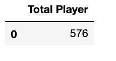
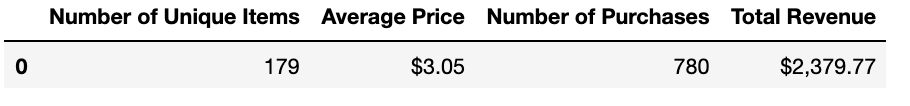
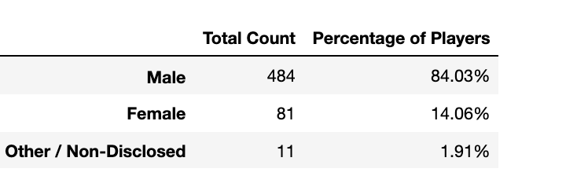
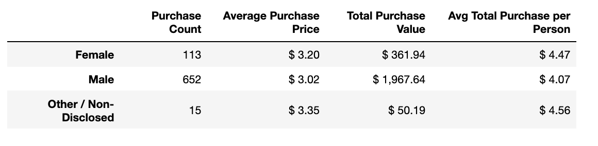
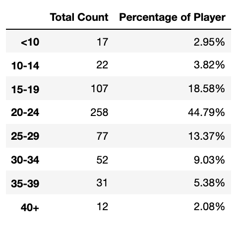
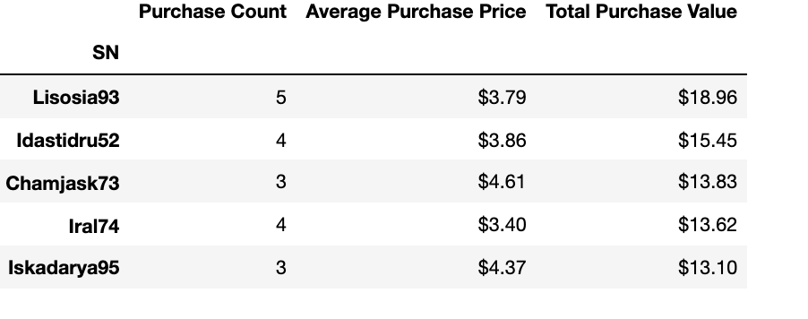
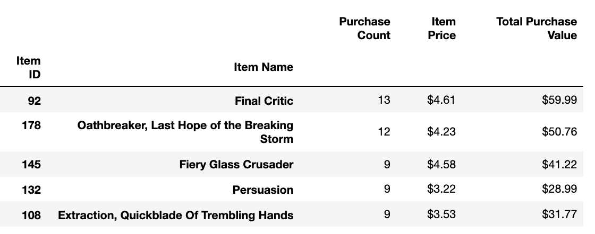

# pandas-challenge

## Background
The data dive continues!
Now, it's time to take what you've learned about Python Pandas and apply it to new situations. For this assignment, you'll need to complete one of two (not both)  Data Challenges. Once again, which challenge you take on is your choice. Just be sure to give it your all -- as the skills you hone will become powerful tools in your data analytics tool belt.

You've been assigned the task of analyzing the data for their most recent fantasy game Heroes of Pymoli.
Like many others in its genre, the game is free-to-play, but players are encouraged to purchase optional items that enhance their playing experience. As a first task, the company would like you to generate a report that breaks down the game's purchasing data into meaningful insights.

## Workflow and results

1. Use pandas to load the Data into the Jupyter notebook and create a Data Frame
2. Because this information contains multiple repeating players, the unique function was used to determine the list of non-repeated player and then there was only needed to determine the length of the list
    
3. An identical procedure was followed to determine the number of unique items purchased
4. After using numpy to determine the Average Price, number of purchase and the total sum of the revenue a new data frame for a summary alongside the number of unique items. For a better display, the function map was used to make a string with two decimal points
    
5. The data was separated in the following demographics
    - Percentage and Count of Male Players
    - Percentage and Count of Female Players
    - Percentage and Count of Other / Non-Disclosed
    
    
6.  For the summary of the Data the next information
    - Purchase count
    - Average. purchase price
    - Average. purchase total per person
    
7.  Also, the age demographics age was calculated in different bins of age, along the Purchase count, Average Purchase Price, Total Purchase Value, average and total Purchase per Person
    
8.  As a final analysis it was determined which players are the top spenders and which items are the most profitable
    
    

